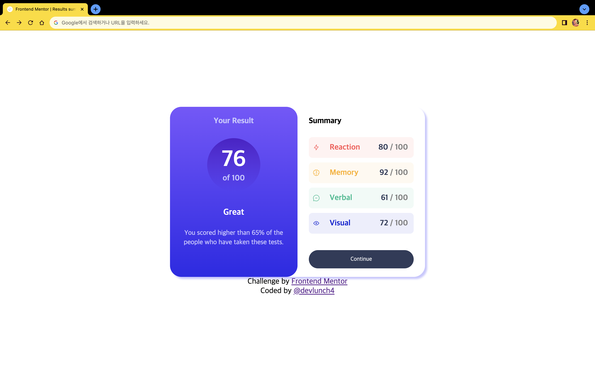
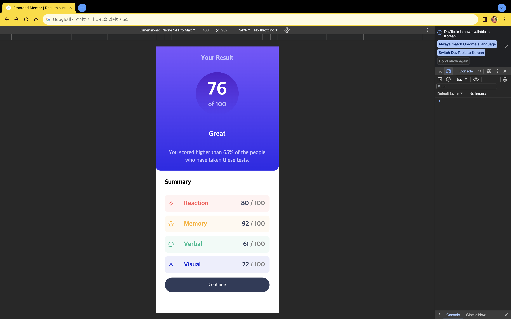

# Frontend Mentor - Results summary component solution

This is a solution to the [Results summary component challenge on Frontend Mentor](https://www.frontendmentor.io/challenges/results-summary-component-CE_K6s0maV). Frontend Mentor challenges help you improve your coding skills by building realistic projects. 

## Table of contents

- [Overview](#overview)
  - [The challenge](#the-challenge)
  - [Screenshot](#screenshot)
  - [Links](#links)
- [My process](#my-process)
  - [Built with](#built-with)
  - [What I learned](#what-i-learned)
  - [Continued development](#continued-development)
  - [Useful resources](#useful-resources)
- [Author](#author)
- [Acknowledgments](#acknowledgments)

## Overview

### The challenge

Users should be able to:

- View the optimal layout for the interface depending on their device's screen size
- See hover and focus states for all interactive elements on the page
- **Bonus**: Use the local JSON data to dynamically populate the content

### Screenshot

- Desktop, Mobile.

 |
--- | --- |

 

### Links

- Solution URL: https://www.frontendmentor.io/solutions/frontend-mentor-results-summary-component-solution-tIwLnckMfu
- Live Site URL: https://devlunch4.github.io/results-summary-component_frontend_mentor/index.html
- github repo: https://github.com/devlunch4/results-summary-component_frontend_mentor

## My process

### Built with

- HTML
- CSS  
- vsCode
- chrome
- firefox

### What I learned

- Results summary component
- View the optimal layout for the interface depending on their device's screen size
- See hover and focus states for all interactive elements on the page
<!-- - <strike>Bonus: Use the local JSON data to dynamically populate the content</strike> -->

### Continued development

- Java
- python
- Web (HTML, CSS...)

### Useful resources

- None.

## Author

- Website - [devlunch4](https://github.com/devlunch4)
- Frontend Mentor - [@devlunch4](https://www.frontendmentor.io/profile/devlunch4)
- Twitter - [@devlunch4](https://www.twitter.com/devlunch4)

## Acknowledgments

- None.